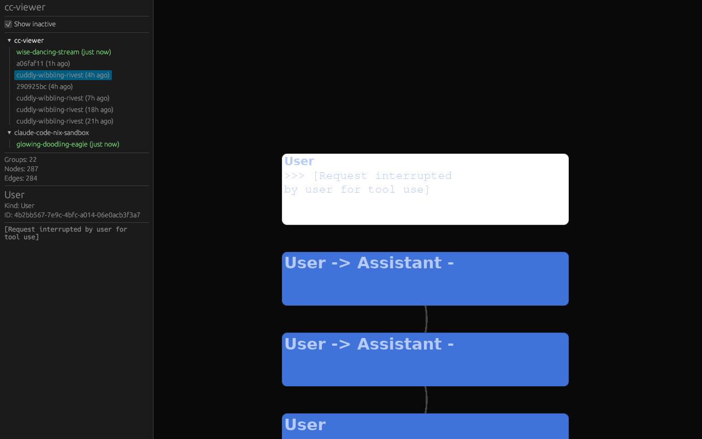

# cc-viewer

Live session visualizer for [Claude Code](https://docs.anthropic.com/en/docs/claude-code). Native Rust GUI that watches Claude Code's runtime directory and renders active sessions as an interactive scrollable timeline.


## Screenshots

**Session overview** — sidebar tree groups sessions by project, canvas shows conversation turns as a vertical stream:


**All sessions** — toggle "Show inactive" to see older sessions with relative timestamps and color coding (green = active, gray = inactive):


**Session with many turns** — switching to a session with 22 conversation groups, 287 nodes:


**Node expanded** — click a node to expand it in-place, showing content. Sidebar shows node details:



**Zoomed out** — scroll to zoom out for a bird's-eye view of the full session:


## Features

- **Live file watching** — monitors Claude Code's runtime dir via inotify, updates in real-time
- **Project tree sidebar** — sessions grouped by project, with active/inactive filtering and timestamps
- **Grouped conversation turns** — collapses User/Assistant/Tool cycles into single nodes
- **In-place expansion** — click a node to reveal a terminal-like content log inside it
- **Subagent collapsing** — subagent records merge into single terminal-style nodes
- **Linear layout** — clean vertical stream matching the sequential nature of conversations
- **GPU rendering** — custom wgpu pipeline with SDF rounded rects, bezier edges, and glyphon text
- **Smooth animations** — animated expand/collapse, zoom-to-node, camera centering

## Quick Start

```bash
# With Nix (recommended)
nix run github:jhhuh/cc-viewer

# Or in a dev shell
nix develop -c cargo run
```

## Documentation

```bash
# Build and serve docs locally
nix run .#docs
# Opens at http://localhost:3000
```

## Architecture

- **eframe 0.31** — window management and egui overlay (sidebar, controls)
- **Custom wgpu pipeline** — node rects (SDF), edge curves (bezier tessellation), camera transforms
- **glyphon 0.8** — GPU text rendering that scales naturally with camera zoom
- **notify 8** — inotify-based file watching for incremental JSONL tailing

## Data Sources

Sessions are read from Claude Code's standard paths:

- Session JSONL: `~/.claude/projects/{project}/{session_id}.jsonl`
- Subagent JSONL: `~/.claude/projects/{project}/{session_id}/subagents/agent-{id}.jsonl`
- Runtime dir: `/tmp/claude-{UID}/` — symlinks to active session files

## Building

Requires Rust toolchain and system libraries for Wayland/X11 + Vulkan/OpenGL.

```bash
# Nix handles all dependencies
nix build

# Or manually with cargo (ensure system deps are available)
cargo build --release
```

## License

MIT
