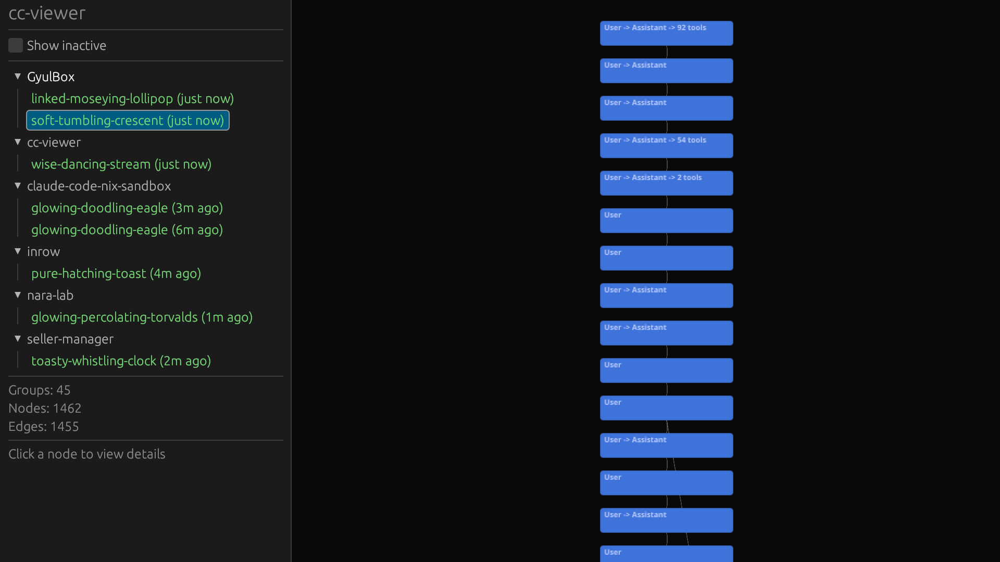

# Understanding the Graph

## Conversation groups

cc-viewer groups raw JSONL records into **conversation turns**. Each turn starts with a User message and includes the following Assistant response, tool calls, and tool results — until the next User message or subagent spawn.

The result is a vertical stream of blocks, each representing one exchange in the conversation.

## Node colors

| Color | Node Kind | Description |
|-------|-----------|-------------|
| Blue (`#4073D9`) | **User** | A user message or User -> Assistant turn |
| Green (`#4DB366`) | **Assistant** | A text response from Claude |
| Orange (`#CC8C33`) | **ToolUse** | A tool call (Bash, Read, Write, Grep, etc.) |
| Tan (`#A67333`) | **ToolResult** | The output returned from a tool call |
| Gray (`#808080`) | **Progress** | Collapsed progress updates (bash output, agent status) |
| Dark (`#141419`) | **Subagent** | Terminal-style node with green text for subagent tasks |
| Dark gray (`#666666`) | **Other** | Unknown or unclassified records |

## Edge meaning

Edges connect sequential conversation groups as curved lines flowing top to bottom. They represent the flow of the conversation.

## Expanding nodes

Click any node to expand it in-place. The expanded view shows a terminal-like content log:

- `>>>` prefix marks user input
- `$` prefix marks tool calls
- `<-` prefix marks tool results
- `@` prefix marks subagent output

The sidebar also shows the node's kind, ID, and raw content.

## Progress collapsing

Claude Code emits `bash_progress` and `agent_progress` records very frequently — often thousands per command as output streams in. cc-viewer collapses these: all consecutive progress records sharing the same `toolUseID` merge into a **single node**.

## Subagent nodes

When Claude Code spawns a subagent (via the Task tool), the subagent's messages are recorded in a separate JSONL file. cc-viewer loads these and merges all records from one subagent into a single terminal-style dark node with green text.

## Layout

Conversation groups are stacked vertically in a simple linear layout:

- **Y axis**: sequential position in the conversation
- **X axis**: all groups are left-aligned at x=0
- **Node size**: 320px wide, 60px tall (collapsed), up to 500px tall (expanded)
- **Gap**: 30px between groups

This reflects the inherently linear nature of Claude Code sessions.

## Active highlighting

Nodes that received updates within the last 2 seconds glow brighter. The brightness decays linearly over the 2-second window, giving visual feedback during live sessions.
