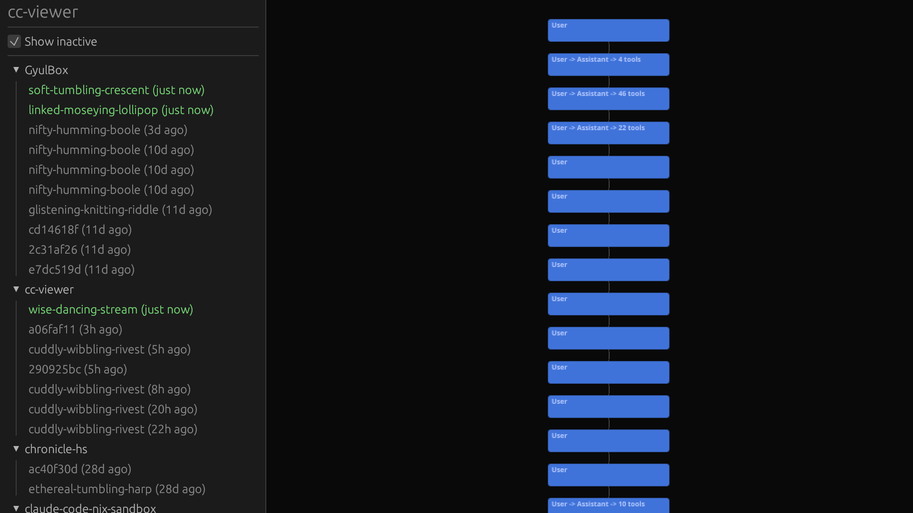
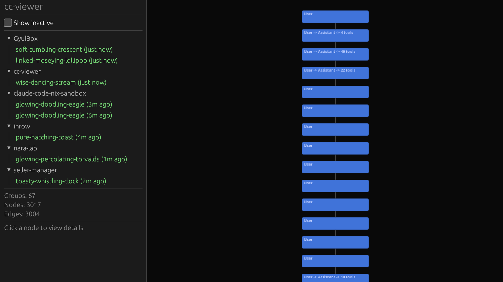
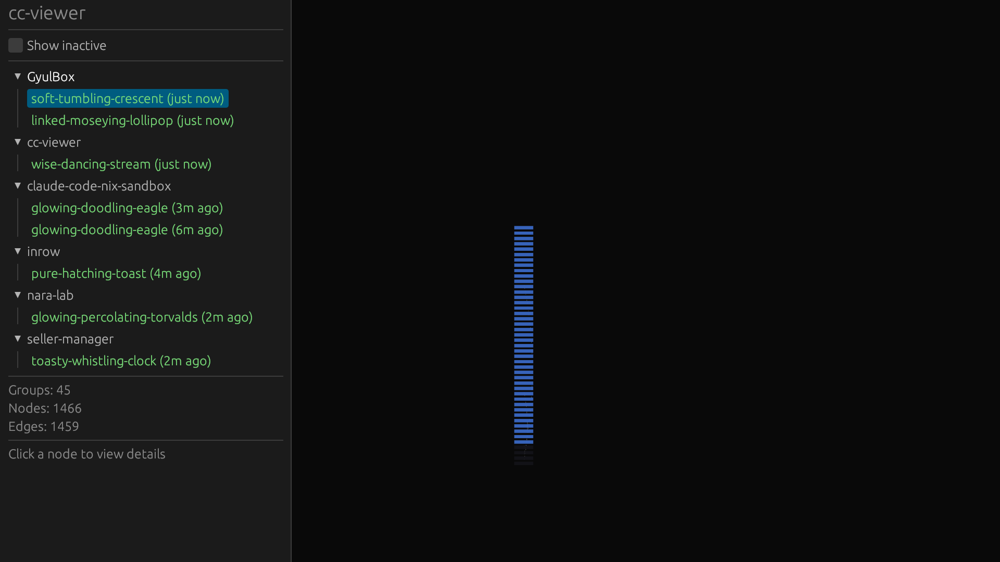

# cc-viewer

**cc-viewer** is a native GPU-accelerated application that visualizes Claude Code sessions as an interactive scrollable timeline on an infinite zoomable canvas.

When Claude Code runs, it writes append-only JSONL logs recording every message, tool call, subagent spawn, and progress update. cc-viewer watches these files in real time, parses them into conversation groups, and renders the result using wgpu with glyphon text — giving you a live, navigable view of what Claude Code is doing.

## What it looks like

"Show inactive" reveals every session across all projects, with relative timestamps. Active sessions appear green, inactive ones gray:

Uncheck "Show inactive" to filter down to live sessions only:

Selecting a session renders its conversation as a vertical stream. Each node shows the flow (User -> Assistant -> N tools):

Scroll to zoom out for a bird's-eye view of the full session timeline:

## Node colors

- **Blue** nodes are user messages (or User -> Assistant turns)
- **Dark terminal** nodes with green text are subagent tasks

Conversation turns are grouped — a single block may contain a User message, Assistant response, and multiple tool calls.

## Key features

- **Live updates**: watches JSONL files via inotify; timeline grows as Claude Code works
- **Project tree sidebar**: sessions grouped by project, with active/inactive filtering and timestamps
- **Infinite canvas**: pan and zoom freely across the entire session
- **GPU text**: glyphon renders text directly in the wgpu pass — no pixelation at any zoom level
- **Progress collapsing**: thousands of `bash_progress` / `agent_progress` records collapse into single nodes
- **Click-to-expand**: click a node to reveal its terminal-like content log in-place
- **Active highlighting**: recently-updated nodes pulse brighter for 2 seconds

## Tech stack

| Component | Choice |
|-----------|--------|
| Window + UI | eframe 0.31 (egui + wgpu) |
| Graph rendering | Custom wgpu pipeline (WGSL shaders) |
| Text rendering | glyphon 0.8 |
| File watching | notify 8 + crossbeam-channel |
| JSON parsing | serde_json |
| Build system | Nix flake + Cargo |
